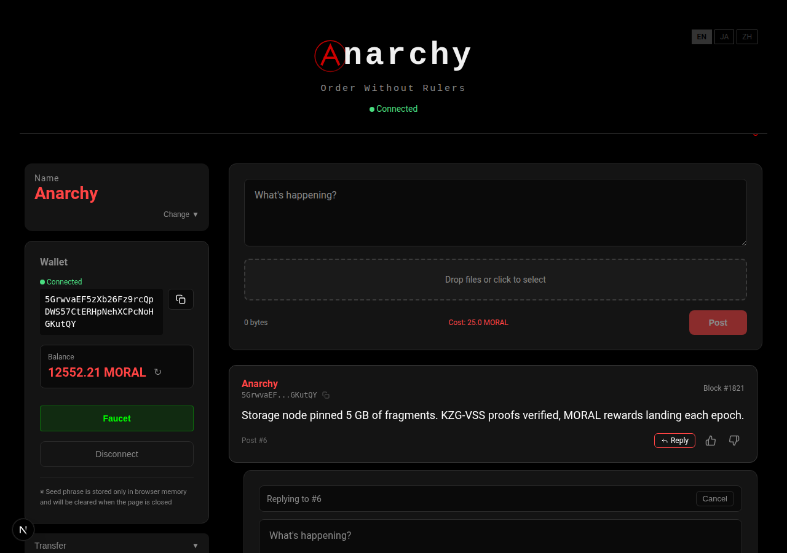
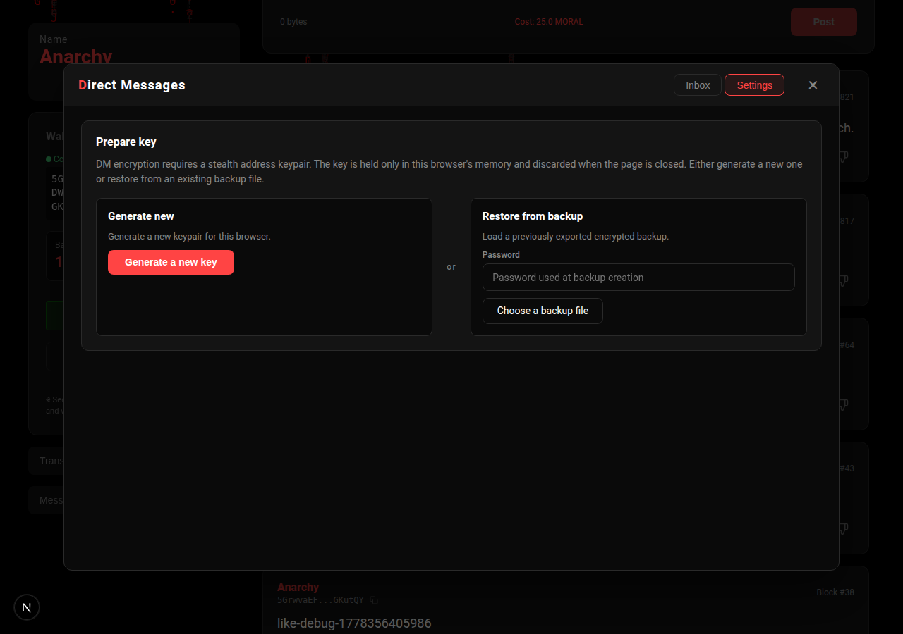
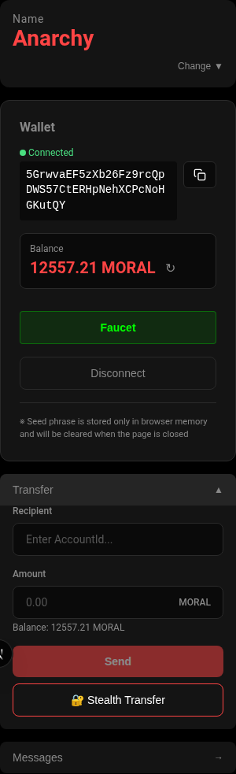

<div align="center">


# Anarchy

**支配なき秩序** — 中央集権を排除した匿名分散型 SNS プロトコル

[](#license)
[](https://substrate.io)
[](https://www.rust-lang.org)
[](https://www.typescriptlang.org)
[](https://nextjs.org)

匿名性をオプションではなく **プロトコル不変条件** として実装した L1 ブロックチェーン SNS。<br>
Substrate + libp2p + Tor + Wasm 暗号エンジン + Next.js を結合した個人開発のフルスタック分散システム。

[Architecture](docs/architecture/overview.md) · [Vision](docs/vision/overview.md) · [Getting Started](docs/development/getting-started.md) · [Docs Index](docs/README.md)

</div>

---

<div align="center">
  
  <br/>
  <sub><em>Timeline — session-only seed-phrase wallet, dynamic byte-cost post form, reaction mining, cMatrix background</em></sub>
</div>

<details>
<summary><b>More screenshots</b></summary>

<div align="center">
  
  <br/>
  <sub><em>Stealth address generator (EIP-5564-compatible) — privacy-preserving one-time addresses for receiving</em></sub>
</div>

<br/>

<div align="center">
  
  <br/>
  <sub><em>Thread reply — inline reply composer that pins to the parent post (KZG-committed content chain)</em></sub>
</div>

<br/>

<div align="center">
  
  <br/>
  <sub><em>Direct Messages — session-only stealth keypair (generate or restore from password-encrypted backup); body is ChaCha20-Poly1305 encrypted with fixed-length padding</em></sub>
</div>

<br/>

<div align="center">
  
  <br/>
  <sub><em>Transfer — plain MORAL transfer + one-click Stealth Transfer (auto-derives one-time address from recipient's meta-address)</em></sub>
</div>

</details>

---

## なぜ作るか

中央集権 SNS は「発信」「凍結」「監視」の 3 つの面でユーザーから主権を奪い続けている。Anarchy は次を満たす:

- **絶対的な発信匿名性** — IP・メタデータをプロトコル層で遮断 (libp2p + Tor 強制)
- **凍結されないアカウント** — 鍵はクライアント側、サーバはアカウントを所有しない
- **物理的に止まらない広場** — 中心がない (P2P)、複数フロントエンド (ハイドラ戦略)
- **関係性を悟られない対話** — ステルスアドレス + 固定長パディング DM

詳細: [docs/vision/](docs/vision/) · [docs/architecture/](docs/architecture/)

## 5 層プロトコルスタック

```
┌─────────────────────────────────────────────────────────────────┐
│ 5. Interface         Next.js (PWA) + Wasm | 複数の独立フロント   │
├─────────────────────────────────────────────────────────────────┤
│ 4. Data Storage      SSS 秘密分散 + Proof of Storage Retrieval   │
├─────────────────────────────────────────────────────────────────┤
│ 3. Consensus         Substrate + 動的 PoW + 反応マイニング        │
├─────────────────────────────────────────────────────────────────┤
│ 2. Identity          シードフレーズ → AccountId (sr25519)         │
├─────────────────────────────────────────────────────────────────┤
│ 1. Network           libp2p + Tor / I2P (匿名強制)                │
└─────────────────────────────────────────────────────────────────┘
```

設計の詳細は [docs/architecture/overview.md](docs/architecture/overview.md)。

## 「誰も発信者にならない」設計 — 責任分散アーキテクチャ

Anarchy は各レイヤーがコンテンツに対する最小限の役割しか担わないよう分割されており、**単独で「平文を保持・配信・公開している」と言える主体が構造的に存在しません**。

| レイヤー | 持っているもの | 持っていないもの |
|---|---|---|
| **Frontend** | UI 描画と暗号化処理のロジックのみ | 投稿本体を保管・配信しない (CDN ではない) |
| **Blockchain** | ハッシュ・KZG コミットメント・座標・転送台帳のみ | 投稿本文・画像・DM 平文を**一切保持しない** |
| **Storage Node** | SSS で断片化された**暗号化バイト列のみ** | 復号鍵を持たず、保存しているのが何かを知り得ない |
| **Tor / I2P** | 匿名化されたパケット中継のみ | 接続元 IP・通信相手を識別できない |

平文を再構成するために必要なすべての要素 (鍵 + 断片集約の権限 + 受信者文脈) を保有するのは **送信者と受信者のみ**。プラットフォーム運営者・ノード運営者・ネットワーク事業者は単独では何も復元できず、いずれも法的な意味での "publisher" / "host" の定義を満たしません。

これは流行りのプライバシー機能ではなく、**プロトコルそのものを「誰も責任を取れない / 取らせられない」形に分解する**ことで実現された構造的な検閲耐性です。

## ストレージを経済的に強制する設計 — KZG 証明ベース報酬

責任を分散するためには **ストレージノードが本当にデータを保管し続けている保証** が要ります。Anarchy はこれを善意ではなく **継続的な経済インセンティブと暗号証明** で強制します。

### 仕組み

1. **KZG コミットメント (KZG-VSS hybrid)** — 投稿 / DM 本体は Wasm エンジンで SSS 断片化され、各断片に `ark-bls12-381` ベースの KZG コミットメントが付く。コミットメントは on-chain に記録され、断片本体は storage node が保持する
2. **PoSR (Proof of Storage Retrieval)** — チェーンが定期的にランダムなインデックスで challenge を発行。storage node はその位置の評価値 + 定数サイズの KZG opening proof を返す。**実データを保持していなければ proof が生成できない**
3. **報酬 (改訂式)** —
   ```
   storage_reward = BaseRewardPerByte × data_size
                  × min(1, σ_storage / σ_target)        // pool 枯渇時は線形減衰
                  × √(node_bond / total_active_bond)    // quadratic Sybil 耐性
   ```
   bond の **平方根スケーリング** により、N 個の Sybil に分散しても Σ√bᵢ ≤ √Σbᵢ (Jensen の不等式) で必ず損になる。独占しても shareᵒ·⁵ が支配的で線形利得にならない
4. **3-way fan-out block reward** — 各ブロック報酬を `miner 50% / storage pool 30% / reaction pool 20%` に分配。**活動 ゼロでも storage pool に常時 30% が注入** され続けるため、SNS の流量に依存せずノード経済が維持される
5. **Tail emission** — 64 回 halving (≈ 256 年) 後も `0.5 MORAL/block` の永続発行。手数料 0 でも 51% 攻撃コストが ∞ に発散する保証
6. **Slashing** — 連続失敗で `bond × min(0.005 × fails, 1.0)` を削減、30% burn / 70% repair pool に還流。bond 0 の捨て垢ノードを構造的に締め出す

### なぜこれが強いか

- **物理的な保管証明** — KZG opening proof は定数サイズ (~48 byte) で、データ全体を提示せずに「特定の位置の値」を検証できる。チェーンが軽量に大量ノードを抜き打ち検査可能
- **経済が経済を守る** — bond を積んだノードは slashing で資本を直接失う。報酬は √bond スケールで上限がかかるので、巨大プレイヤーも Sybil 分散も儲からない
- **コンテンツの中身を知らずに保管を強制** — 検証は KZG コミットメントの数学的性質のみに依存。ノード運営者は何を保管しているか理解しないまま、しかし確実に保管していることだけは証明できる
- **活動依存からの解放** — 投稿手数料 (storage tip) だけに依存していると DAU=0 でプール枯渇 → ノード撤退 → データ消失。block reward の 30% 注入で **活動量と独立にノード経済が成立**

完全な設計と数式は [docs/economic/proposal.md (TSTS モデル)](docs/economic/proposal.md) と [docs/architecture/storage.md](docs/architecture/storage.md) を参照。

## 技術スタック

| レイヤー | 技術 |
|---|---|
| Blockchain | Substrate (Polkadot SDK stable2503), Rust, FRAME pallet × 14 |
| Storage Node | Rust, libp2p, axum, redb |
| Wasm Engine | `ark-bls12-381` (KZG-VSS), `rs_merkle`, Blake2b, EIP-5564 互換ステルス |
| Frontend | Next.js 14 (App Router), React 18, TypeScript, PAPI |
| Crypto | sr25519, ChaCha20-Poly1305 (DM), KZG コミットメント |
| Network | libp2p + Tor (torsocks 経由), GossipSub, Kademlia |
| Anonymity | ステルスアドレス, SSS (Shamir's Secret Sharing), 固定長パディング |

## モノレポ構成

```
anarchy/
├── apps/
│   ├── blockchain/    # Substrate L1 (node + runtime + pallets/ × 14)
│   ├── storage-node/  # libp2p 分散ストレージデーモン
│   └── frontend/      # Next.js PWA (PAPI WebSocket)
├── packages/
│   ├── wasm-engine/   # Rust → Wasm 暗号エンジン (KZG, SSS, Merkle, DM)
│   └── kzg-constants/ # KZG セットアップ定数
├── docs/              # 設計・運用・経済モデル文書 (docs/README.md 索引)
├── scripts/           # PAPI CLI ツール (mint, transfer, exporter)
└── infra/             # Grafana ダッシュボード
```

各 app の詳細はそれぞれの README を参照:
[apps/blockchain](apps/blockchain/) ·
[apps/storage-node](apps/storage-node/README.md) ·
[apps/frontend](apps/frontend/) ·
[packages/wasm-engine](packages/wasm-engine/)

## Quick Start

```bash
# 1. 必要なツールを揃える
rustup target add wasm32v1-none
rustup component add rust-src
npm install -g pnpm
cargo install wasm-pack

# 2. リポジトリをクローンして依存を入れる
git clone https://github.com/<owner>/anarchy.git
cd anarchy
pnpm install

# 3. testnet + storage + frontend を一括起動
pnpm stack:start          # 起動
pnpm stack:status         # 稼働確認
# ブラウザで http://localhost:3000

pnpm stack:stop           # 停止
```

詳しい手順 (個別起動, Mint, Tor 強制モード) は [docs/development/getting-started.md](docs/development/getting-started.md) を参照。

## ドキュメント

| カテゴリ | 内容 |
|---|---|
| [Vision](docs/vision/) | プロジェクトの目的・新規性・課題分析 |
| [Architecture](docs/architecture/) | 各レイヤーの技術仕様 |
| [Economic Model](docs/economic/) | TSTS 経済モデル設計・パラメータ |
| [Operations](docs/operations/) | mainnet 運用 / Tor / PoW 設定 |
| [Security](docs/security/) | 脅威モデル分析 |
| [Development](docs/development/) | 起動手順 / コマンド / TODO |

→ [docs/README.md](docs/README.md) (全索引)

## Contributing

開発に参加する場合は [CONTRIBUTING.md](CONTRIBUTING.md) を参照。

## License

Anarchy is **multi-licensed** to compose correctly with its upstream dependencies:

| Component | License (SPDX) |
|---|---|
| `apps/blockchain/node/` | `GPL-3.0-or-later WITH Classpath-exception-2.0` (matches `sc-*` deps) |
| `apps/blockchain/runtime/` + `pallets/*` | `Apache-2.0` (matches `frame-*` / `sp-*` deps) |
| `apps/storage-node/` | `MIT OR Apache-2.0` |
| `apps/frontend/` | `MIT` |
| `packages/wasm-engine/` + `kzg-constants/` | `MIT OR Apache-2.0` |

Full texts: [LICENSE](LICENSE) (summary) · [LICENSE-MIT](LICENSE-MIT) · [LICENSE-APACHE-2.0](LICENSE-APACHE-2.0) · [LICENSE-GPL-3.0](LICENSE-GPL-3.0)
