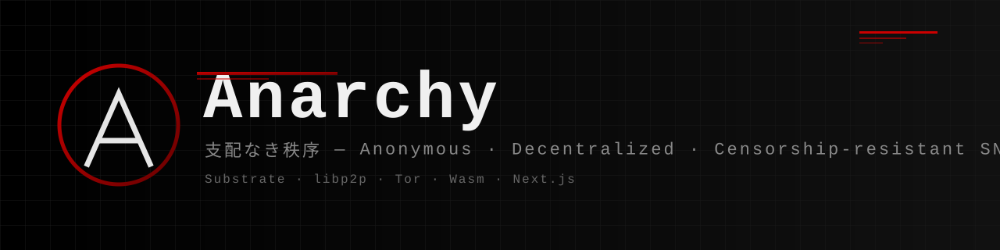
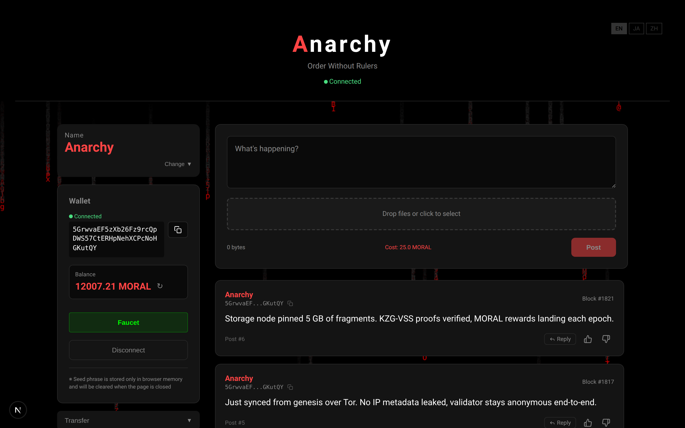
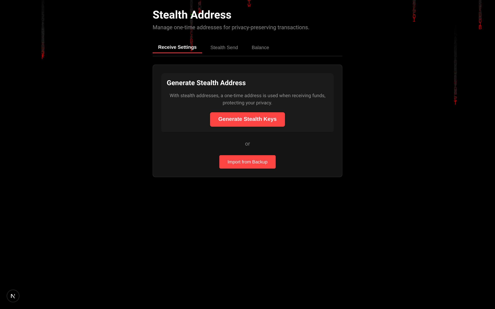

<div align="center">



# Anarchy

**支配なき秩序** — 中央集権を排除した匿名分散型 SNS プロトコル

[](#license)
[](https://substrate.io)
[](https://www.rust-lang.org)
[](https://www.typescriptlang.org)
[](https://nextjs.org)

匿名性をオプションではなく **プロトコル不変条件** として実装した L1 ブロックチェーン SNS。<br>
Substrate + libp2p + Tor + Wasm 暗号エンジン + Next.js を結合した個人開発のフルスタック分散システム。

[Architecture](docs/architecture/overview.md) · [Vision](docs/vision/overview.md) · [Getting Started](docs/development/getting-started.md) · [Docs Index](docs/README.md)

</div>

---

<div align="center">
  
  <br/>
  <sub><em>Timeline — session-only seed-phrase wallet, dynamic byte-cost post form, reaction mining, cMatrix background</em></sub>
</div>

<details>
<summary><b>More screenshots</b></summary>

<div align="center">
  
  <br/>
  <sub><em>Stealth address generator (EIP-5564-compatible) — privacy-preserving one-time addresses for receiving</em></sub>
</div>

</details>

---

## なぜ作るか

中央集権 SNS は「発信」「凍結」「監視」の 3 つの面でユーザーから主権を奪い続けている。Anarchy は次を満たす:

- **絶対的な発信匿名性** — IP・メタデータをプロトコル層で遮断 (libp2p + Tor 強制)
- **凍結されないアカウント** — 鍵はクライアント側、サーバはアカウントを所有しない
- **物理的に止まらない広場** — 中心がない (P2P)、複数フロントエンド (ハイドラ戦略)
- **関係性を悟られない対話** — ステルスアドレス + 固定長パディング DM

詳細: [docs/vision/](docs/vision/) · [docs/architecture/](docs/architecture/)

## 5 層プロトコルスタック

```
┌─────────────────────────────────────────────────────────────────┐
│ 5. Interface         Next.js (PWA) + Wasm | 複数の独立フロント   │
├─────────────────────────────────────────────────────────────────┤
│ 4. Data Storage      SSS 秘密分散 + Proof of Storage Retrieval   │
├─────────────────────────────────────────────────────────────────┤
│ 3. Consensus         Substrate + 動的 PoW + 反応マイニング        │
├─────────────────────────────────────────────────────────────────┤
│ 2. Identity          シードフレーズ → AccountId (sr25519)         │
├─────────────────────────────────────────────────────────────────┤
│ 1. Network           libp2p + Tor / I2P (匿名強制)                │
└─────────────────────────────────────────────────────────────────┘
```

設計の詳細は [docs/architecture/overview.md](docs/architecture/overview.md)。

## 「誰も発信者にならない」設計 — 責任分散アーキテクチャ

Anarchy は各レイヤーがコンテンツに対する最小限の役割しか担わないよう分割されており、**単独で「平文を保持・配信・公開している」と言える主体が構造的に存在しません**。

| レイヤー | 持っているもの | 持っていないもの |
|---|---|---|
| **Frontend** | UI 描画と暗号化処理のロジックのみ | 投稿本体を保管・配信しない (CDN ではない) |
| **Blockchain** | ハッシュ・KZG コミットメント・座標・転送台帳のみ | 投稿本文・画像・DM 平文を**一切保持しない** |
| **Storage Node** | SSS で断片化された**暗号化バイト列のみ** | 復号鍵を持たず、保存しているのが何かを知り得ない |
| **Tor / I2P** | 匿名化されたパケット中継のみ | 接続元 IP・通信相手を識別できない |

平文を再構成するために必要なすべての要素 (鍵 + 断片集約の権限 + 受信者文脈) を保有するのは **送信者と受信者のみ**。プラットフォーム運営者・ノード運営者・ネットワーク事業者は単独では何も復元できず、いずれも法的な意味での "publisher" / "host" の定義を満たしません。

これは流行りのプライバシー機能ではなく、**プロトコルそのものを「誰も責任を取れない / 取らせられない」形に分解する**ことで実現された構造的な検閲耐性です。

## 技術スタック

| レイヤー | 技術 |
|---|---|
| Blockchain | Substrate (Polkadot SDK stable2503), Rust, FRAME pallet × 14 |
| Storage Node | Rust, libp2p, axum, redb |
| Wasm Engine | `ark-bls12-381` (KZG-VSS), `rs_merkle`, Blake2b, EIP-5564 互換ステルス |
| Frontend | Next.js 14 (App Router), React 18, TypeScript, PAPI |
| Crypto | sr25519, ChaCha20-Poly1305 (DM), KZG コミットメント |
| Network | libp2p + Tor (torsocks 経由), GossipSub, Kademlia |
| Anonymity | ステルスアドレス, SSS (Shamir's Secret Sharing), 固定長パディング |

## モノレポ構成

```
anarchy/
├── apps/
│   ├── blockchain/    # Substrate L1 (node + runtime + pallets/ × 14)
│   ├── storage-node/  # libp2p 分散ストレージデーモン
│   └── frontend/      # Next.js PWA (PAPI WebSocket)
├── packages/
│   ├── wasm-engine/   # Rust → Wasm 暗号エンジン (KZG, SSS, Merkle, DM)
│   └── kzg-constants/ # KZG セットアップ定数
├── docs/              # 設計・運用・経済モデル文書 (docs/README.md 索引)
├── scripts/           # PAPI CLI ツール (mint, transfer, exporter)
└── infra/             # Grafana ダッシュボード
```

各 app の詳細はそれぞれの README を参照:
[apps/blockchain](apps/blockchain/) ·
[apps/storage-node](apps/storage-node/README.md) ·
[apps/frontend](apps/frontend/) ·
[packages/wasm-engine](packages/wasm-engine/)

## Quick Start

```bash
# 1. 必要なツールを揃える
rustup target add wasm32v1-none
rustup component add rust-src
npm install -g pnpm
cargo install wasm-pack

# 2. リポジトリをクローンして依存を入れる
git clone https://github.com/<owner>/anarchy.git
cd anarchy
pnpm install

# 3. testnet + storage + frontend を一括起動
pnpm stack:start          # 起動
pnpm stack:status         # 稼働確認
# ブラウザで http://localhost:3000

pnpm stack:stop           # 停止
```

詳しい手順 (個別起動, Mint, Tor 強制モード) は [docs/development/getting-started.md](docs/development/getting-started.md) を参照。

## ハイライト

- **PAPI への完全移行** — Polkadot SDK stable2503 (metadata v16) で legacy `@polkadot/api` が動かないため、フロント / CLI / E2E すべて PAPI (`getUnsafeApi`) で実装
- **クライアントサイド完結暗号** — 秘密鍵はセッションメモリにのみ存在。ブラウザ永続化なし。SSS 断片化・KZG コミット生成は全て Wasm で実行
- **chain-node → storage-node 集約** — フロントは storage-node に直接接続しない。`storage_*` RPC を chain-node 拡張に実装して IP 相関を遮断
- **Foreground PoW** — 反応マイニングは Page Visibility API でフォアグラウンドのみ動作
- **mainnet で Tor 強制** — chain_id に "mainnet" を含むと `TorMode::Forced` が自動有効化

## ドキュメント

| カテゴリ | 内容 |
|---|---|
| [Vision](docs/vision/) | プロジェクトの目的・新規性・課題分析 |
| [Architecture](docs/architecture/) | 各レイヤーの技術仕様 |
| [Economic Model](docs/economic/) | TSTS 経済モデル設計・パラメータ |
| [Operations](docs/operations/) | mainnet 運用 / Tor / PoW 設定 |
| [Security](docs/security/) | 脅威モデル分析 |
| [Development](docs/development/) | 起動手順 / コマンド / TODO |

→ [docs/README.md](docs/README.md) (全索引)

## Contributing

開発に参加する場合は [CONTRIBUTING.md](CONTRIBUTING.md) を参照。

## License

Anarchy is **multi-licensed** to compose correctly with its upstream dependencies:

| Component | License (SPDX) |
|---|---|
| `apps/blockchain/node/` | `GPL-3.0-or-later WITH Classpath-exception-2.0` (matches `sc-*` deps) |
| `apps/blockchain/runtime/` + `pallets/*` | `Apache-2.0` (matches `frame-*` / `sp-*` deps) |
| `apps/storage-node/` | `MIT OR Apache-2.0` |
| `apps/frontend/` | `MIT` |
| `packages/wasm-engine/` + `kzg-constants/` | `MIT OR Apache-2.0` |

Full texts: [LICENSE](LICENSE) (summary) · [LICENSE-MIT](LICENSE-MIT) · [LICENSE-APACHE-2.0](LICENSE-APACHE-2.0) · [LICENSE-GPL-3.0](LICENSE-GPL-3.0)
