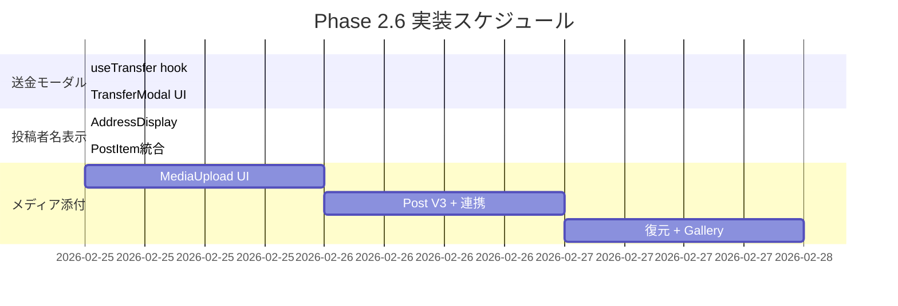

# フロントエンド拡充 (Phase 2.6) 実装戦略

## 概要

Phase 2.6では以下3機能を段階的に実装する:

| 順番 | 機能 | 難易度 | 見積 | 依存関係 |
|-----|------|--------|-----|----------|
| 1 | 送金モーダル | 低 | 0.5日 | なし |
| 2 | 投稿者名表示 | 低 | 0.5日 | なし |
| 3 | メディア添付対応 | 中 | 2-3日 | 既存Storage基盤 |

---

## 1. 送金モーダル (`TransferModal`)

### 目的
ユーザー間でMORALトークンを送金するUI

### 設計

```
components/
├── TransferModal.tsx          # モーダル本体
├── TransferModal.module.css   # スタイル
hooks/
├── useTransfer.ts             # 送金ロジック
```

### 機能要件

| 要件 | 詳細 |
|------|------|
| 宛先入力 | AccountId (SS58形式) + バリデーション |
| 金額入力 | MORAL単位、残高上限チェック |
| 送金実行 | `Balances.transfer_allow_death` (PAPI経由) |
| 状態表示 | pending / success / error |
| エラー処理 | 残高不足、無効アドレス、ネットワークエラー |

### バリデーション
- AccountId形式検証: `@polkadot/util-crypto` の `decodeAddress`
- 残高チェック: `amount <= balance - existentialDeposit`
- 最小送金額: 0.001 MORAL (1_000_000_000 units)

### UIフロー
```
[送金ボタン] → [モーダル]
  ├─ 宛先AccountId入力
  ├─ 金額入力 (MORAL) + 残高表示
  ├─ [キャンセル] / [送金]
  └─ 結果表示 → [閉じる]
```

### i18n翻訳キー追加
```typescript
| 'transfer.title'
| 'transfer.recipient'
| 'transfer.recipientPlaceholder'
| 'transfer.amount'
| 'transfer.amountPlaceholder'
| 'transfer.insufficient'
| 'transfer.invalidAddress'
| 'transfer.send'
| 'transfer.sending'
| 'transfer.success'
| 'transfer.error'
| 'transfer.cancel'
```

---

## 2. 投稿者名表示改善

### 現状
- `PostItem` で `shortenAddress(author)` を使用中
- コピー機能なし

### 改善点

| 機能 | 実装 |
|------|------|
| 短縮表示 | 先頭6文字...末尾4文字 (既存) |
| クリックコピー | 全AccountIdをクリップボードへ |
| コピー確認 | ツールチップ "Copied!" 表示 |
| ホバー表示 | 全AccountIdをtooltipで表示 |

### ファイル変更
```
components/
├── AddressDisplay.tsx         # 新規: 再利用可能なアドレス表示
├── AddressDisplay.module.css
└── PostItem.tsx               # 修正: AddressDisplay使用
```

### i18n追加
```typescript
| 'address.copied'
| 'address.clickToCopy'
```

---

## 3. メディア添付対応

### アーキテクチャ
既存の分散ストレージ基盤 (SSS分割 → Storage Node) を活用

```
[画像/動画ファイル]
    ↓ (ブラウザ)
[リサイズ/圧縮] (画像のみ)
    ↓
[hybrid_split()] (KZG-VSS)
    ↓
[Storage Nodes] (複数ノード分散)
    ↓
[create_post_v2] (merkle_roots記録)
```

### Post V2拡張
```rust
// ContentRef拡張案
struct ContentRefV3 {
    root: [u8; 32],          // テキストコンテンツのMerkle Root
    k: u8,
    n: u8,
    total_size: u32,
    ciphertext_len: u32,
    shard_size: u32,
    compressed: bool,
    // 新規フィールド
    media_refs: Vec<MediaRef>,
}

struct MediaRef {
    root: [u8; 32],           // メディアのMerkle Root
    media_type: MediaType,    // Image / Video
    size_bytes: u32,
    width: u16,               // 画像の場合
    height: u16,
}

enum MediaType {
    Image,
    Video,
}
```

### ファイルサイズ制限
| タイプ | 最大サイズ | フォーマット |
|--------|-----------|--------------|
| 画像 | 100 MB | JPEG, PNG, GIF, WebP |
| 動画 | 1000 MB | MP4, WebM |

### コンポーネント設計
```
components/
├── MediaUpload.tsx           # ドラッグ&ドロップ + ファイル選択
├── MediaUpload.module.css
├── MediaPreview.tsx          # 画像/動画プレビュー
├── MediaPreview.module.css
├── MediaGallery.tsx          # タイムライン表示用ギャラリー
└── MediaGallery.module.css
hooks/
├── useMediaUpload.ts         # メディアアップロードロジック
├── useMediaRecover.ts        # メディア復元ロジック
```

### 実装ステップ (3日想定)

| Day | タスク |
|-----|--------|
| 1 | MediaUpload UI + クライアント側バリデーション |
| 2 | Post Pallet V3: media_refs対応 + hybrid_split連携 |
| 3 | 復元ロジック + MediaGallery + テスト |

---

## 実装順序



---

## テスト戦略

### 送金モーダル
- `useTransfer.test.ts`: バリデーション、エラーハンドリング
- `TransferModal.test.tsx`: UI操作、状態遷移

### 投稿者名表示
- `AddressDisplay.test.tsx`: 短縮表示、コピー機能

### メディア添付
- `useMediaUpload.test.ts`: ファイルバリデーション、分割処理
- `useMediaRecover.test.ts`: 復元処理
- `MediaPreview.test.tsx`: 表示レンダリング

---

## 注意事項

1. **PAPI必須**: `@polkadot/api` は使用しない (stable2503互換性問題)
2. **i18n**: 全テキストは翻訳キー経由
3. **CSS Modules**: グローバルCSSは使用しない
4. **エラーハンドリング**: ユーザーフレンドリーなメッセージ表示

---

## バグ修正戦略

### Bug 1: Faucet 初回でも2回目エラー表示

#### 現象
ブロックチェーン側で正常に処理されても、フロントエンドがエラーを表示する

#### 根本原因分析

| 箇所 | 行 | 問題 |
|------|-----|------|
| submitError判定 | L283-291 | `message.includes('Invalid')` が広すぎる。smoldotの正常な応答も "Invalid" を含むことがある |
| result.error判定 | L295-298 | `result.error` が存在するだけで AlreadyClaimed 扱い。実際のエラー内容を確認していない |
| 検証タイムアウト | L330-332 | 12秒で検証できないと AlreadyClaimed エラー。smoldot同期遅延で正常txも失敗扱い |

#### 修正戦略

**戦略A: エラー判定の厳格化** (推奨)
```typescript
// Before: 広すぎる判定
if (message.includes('Invalid') || message.includes('dispatch')) {
  throw new Error('AlreadyClaimed...')
}

// After: 明示的なエラーのみ検出
if (message.includes('Custom(1)') || message.includes('AlreadyClaimed')) {
  throw new Error('AlreadyClaimed...')
}
```

**戦略B: 検証タイムアウト延長 + 成功扱い**
```typescript
// タイムアウトを 12秒 → 24秒 に延長
const maxWaitMs = 24000

// タイムアウト時はエラーではなく警告扱い
if (!claimVerified) {
  console.warn('[useFaucet] Claim not verified but tx accepted')
  // エラーを投げない → 成功扱い
}
```

**戦略C: result.errorの内容確認**
```typescript
if (result && typeof result === 'object' && 'error' in result) {
  const errorStr = JSON.stringify(result.error).toLowerCase()
  // AlreadyClaimedを明示的に示すエラーのみ
  if (errorStr.includes('already') || errorStr.includes('custom(1)')) {
    throw new Error('AlreadyClaimed...')
  }
  // 他のエラーは無視して検証フェーズへ
}
```

#### 推奨アプローチ
**A + B + C の組み合わせ**:
1. エラー文字列判定を厳格化 (A)
2. result.errorの内容を確認 (C)
3. 検証タイムアウトを延長し、タイムアウト時は成功扱い (B)

---

### Bug 2: 投稿コンテンツで画面が無限に長くなる

#### 現象
長文投稿がそのまま表示され、画面が縦に伸びる

#### 根本原因
`Timeline.module.css` の `.text` クラスに高さ制限がない

```css
/* 現状 */
.text {
  white-space: pre-wrap;  /* 改行保持 */
  /* 高さ制限なし */
}
```

#### 修正戦略

**戦略A: CSSのみで制限** (推奨 - レイアウト変更なし)
```css
.text {
  max-height: 300px;
  overflow-y: auto;
}
```

**戦略B: "もっと見る" ボタン** (UI変更あり)
- PostItemにexpand/collapse状態を追加
- 閾値超えで truncate + "もっと見る" 表示
- クリックで全文表示

**戦略C: 文字数制限 + "続きを読む"** (UI変更あり)
- 500文字超で truncate
- "続きを読む" でモーダル表示

#### 推奨アプローチ
**戦略A** - レイアウト/UI変更なしの要件に最適

---

### 実装優先度

| バグ | 影響度 | 修正難易度 | 優先度 |
|------|--------|-----------|--------|
| Faucetエラー | 高 (初回ユーザー体験) | 低 | **1** |
| コンテンツ長さ | 中 (UX) | 低 | **2** |

---

## 投稿者ニックネーム表示 戦略

### 現状

- Identity Palletは**廃止済み**（WebAuthn複雑さのため）
- AccountIdのみでユーザー識別
- ニックネーム保存機構なし

### 実現方法の選択肢

| 方式 | 難易度 | 工数 | メリット | デメリット |
|------|--------|------|----------|------------|
| **A: Substrate標準pallet-identity** | 中 | 1-2日 | エコシステム互換、検証済み | オーバースペック、デポジット必要 |
| **B: 軽量Nickname Pallet新規作成** | 低 | 0.5日 | シンプル、カスタマイズ自由 | 独自実装、テスト必要 |
| **C: オフチェーン（localStorage + P2P）** | 低 | 0.5日 | パレット変更不要、即実装可 | 永続性なし、デバイス間同期難 |
| **D: 分散ストレージ（プロフィールJSON）** | 中 | 1日 | 検閲耐性、永続性あり | 複雑、コスト発生 |

---

### 方式A: Substrate標準 pallet-identity

Polkadot/Kusamaで使用されている標準パレットをそのまま導入

```rust
// runtime/Cargo.toml
pallet-identity = { workspace = true }

// runtime/src/lib.rs
impl pallet_identity::Config for Runtime {
    type RuntimeEvent = RuntimeEvent;
    type Currency = Balances;
    type BasicDeposit = ConstU128<10_000_000_000_000>;  // 10 MORAL
    type ByteDeposit = ConstU128<100_000_000_000>;      // 0.1 MORAL/byte
    type MaxAdditionalFields = ConstU32<2>;
    type IdentityInformation = pallet_identity::legacy::IdentityInfo<64>;
    // ... 他設定
}
```

**フロントエンド**:
```typescript
// ニックネーム設定
api.tx.Identity.set_identity({
  display: { Raw: encodeUtf8("alice_anarchy") }
})

// ニックネーム取得
const identity = await api.query.Identity.IdentityOf(accountId)
const displayName = identity?.info?.display?.asRaw
```

**メリット**:
- Polkadot.js等と互換
- 登録者証明（registrar）機能あり
- 実績あるコード

**デメリット**:
- デポジット必要（設定可能だが）
- 多機能すぎる（email, web, twitter等）

---

### 方式B: 軽量Nickname Pallet新規作成 ⭐推奨

最小限の機能でニックネームのみを管理

```rust
// pallets/nickname/src/lib.rs
#[pallet::storage]
pub type Nicknames<T: Config> = StorageMap<_, Blake2_128Concat, T::AccountId, BoundedVec<u8, T::MaxLength>>;

#[pallet::call]
impl<T: Config> Pallet<T> {
    #[pallet::weight(10_000)]
    pub fn set_nickname(origin: OriginFor<T>, name: BoundedVec<u8, T::MaxLength>) -> DispatchResult {
        let who = ensure_signed(origin)?;
        // 文字数チェック、禁止ワードチェック等
        Nicknames::<T>::insert(&who, name.clone());
        Self::deposit_event(Event::NicknameSet { account: who, nickname: name });
        Ok(())
    }
    
    #[pallet::weight(5_000)]
    pub fn clear_nickname(origin: OriginFor<T>) -> DispatchResult {
        let who = ensure_signed(origin)?;
        Nicknames::<T>::remove(&who);
        Self::deposit_event(Event::NicknameCleared { account: who });
        Ok(())
    }
}
```

**設定**:
- MaxLength: 32文字 (UTF-8で最大128バイト)
- コスト: 無料 or PostBaseCostと同額

**フロントエンド**:
```typescript
// 設定
api.tx.Nickname.set_nickname("alice_anarchy")

// 取得
const nickname = await api.query.Nickname.Nicknames(accountId)
```

**メリット**:
- シンプル、軽量
- デポジット不要（または任意設定）
- 必要な機能のみ

**デメリット**:
- 独自実装のためテスト必要

---

### 方式C: オフチェーン（localStorage + オプションP2P共有）

パレット変更なし、フロントエンドのみで実装

```typescript
// lib/nickname.ts
interface NicknameStore {
  [accountId: string]: string
}

// ローカル保存
const setLocalNickname = (accountId: string, name: string) => {
  const store = JSON.parse(localStorage.getItem('nicknames') || '{}')
  store[accountId] = name
  localStorage.setItem('nicknames', JSON.stringify(store))
}

// 取得（ローカル優先、P2P補完）
const getNickname = async (accountId: string): Promise<string | null> => {
  const local = getLocalNickname(accountId)
  if (local) return local
  
  // オプション: 分散ストレージから取得
  // return await fetchFromStorage(accountId)
  return null
}
```

**メリット**:
- パレット変更不要
- 即座に実装可能
- トランザクション不要

**デメリット**:
- 永続性なし（ブラウザ依存）
- 他ユーザーから見えない（自分用ラベルのみ）
- デバイス間同期なし

---

### 方式D: 分散ストレージ（プロフィールJSON）

既存のストレージインフラを活用してプロフィールを保存

```typescript
// プロフィールJSON構造
interface UserProfile {
  version: 1
  nickname: string
  bio?: string
  avatar_merkle_root?: string  // 将来のアバター画像用
  updated_at: number
}

// 保存時
const profile: UserProfile = { version: 1, nickname: "alice", updated_at: Date.now() }
const { merkleRoot } = await hybridSplit(JSON.stringify(profile))
// merkleRootをオンチェーン or ローカルに保存

// 取得時
const profile = await recoverContent(merkleRoot)
```

**メリット**:
- 検閲耐性あり
- 永続性あり
- 将来拡張可能（bio, avatar等）

**デメリット**:
- ストレージコスト発生
- 複雑
- 更新のたびに新merkleRoot

---

### 推奨アプローチ

**段階的実装**:

| Phase | 内容 | 工数 |
|-------|------|------|
| **Phase 1** | 方式C: ローカルニックネーム（自分用ラベル） | 0.5日 |
| **Phase 2** | 方式B: Nickname Pallet（オンチェーン、全員に表示） | 1日 |
| Phase 3（将来） | 方式D: プロフィール拡張（bio, avatar） | 追加機能時 |

**Phase 1の即時効果**:
- 投稿者にローカルでラベル付け可能
- トランザクション不要
- 自分のアカウントにも設定可能

**Phase 2でグローバル対応**:
- 他ユーザーにも表示されるニックネーム
- オンチェーン永続化

---

### ファイル構成（Phase 1）

```
components/
├── NicknameEditor.tsx        # ニックネーム設定UI
├── NicknameEditor.module.css
hooks/
├── useNickname.ts            # ローカルニックネーム管理
lib/
├── nickname-store.ts         # localStorage操作
```

### i18n追加

```typescript
| 'nickname.set'
| 'nickname.placeholder'
| 'nickname.saved'
| 'nickname.clear'
```

