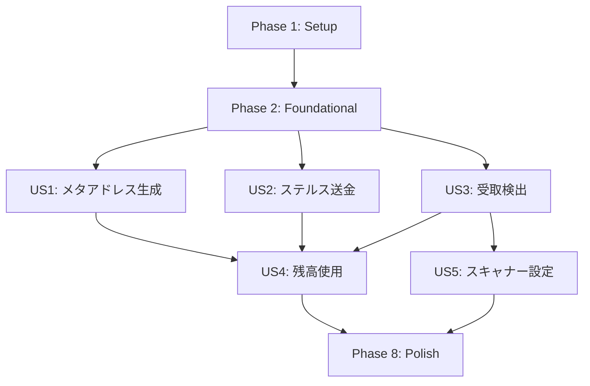

# Tasks: ステルスアドレス統合

**Input**: Design documents from `/specs/016-stealth-address/`
**Prerequisites**: plan.md, spec.md, research.md, data-model.md, contracts/

**Tests**: Test-First Development required (Constitution VI). テストはimplementation前に記述。

**Organization**: Tasks are grouped by user story to enable independent implementation and testing.

## Format: `[ID] [P?] [Story?] Description`

- **[P]**: Can run in parallel (different files, no dependencies)
- **[Story]**: Which user story this task belongs to (US1, US2, etc.)
- Exact file paths included

## Path Conventions

- **Blockchain pallet**: `apps/blockchain/pallets/stealth/`
- **Wasm engine**: `packages/wasm-engine/src/stealth/`
- **Frontend lib**: `apps/frontend/src/lib/stealth/`
- **Frontend components**: `apps/frontend/src/components/stealth/`

---

## Phase 1: Setup (Shared Infrastructure)

**Purpose**: Project initialization, directory structure, dependencies

- [X] T001 Create pallet directory structure in apps/blockchain/pallets/stealth/
- [X] T002 Create stealth module directory in packages/wasm-engine/src/stealth/
- [X] T003 [P] Create frontend stealth lib directory in apps/frontend/src/lib/stealth/
- [X] T004 [P] Create frontend stealth components directory in apps/frontend/src/components/stealth/
- [X] T005 Add x25519-dalek, aes-gcm, pbkdf2 dependencies to packages/wasm-engine/Cargo.toml
- [X] T006 Add pallet-stealth to apps/blockchain/Cargo.toml workspace members

---

## Phase 2: Foundational (Blocking Prerequisites)

**Purpose**: Core Wasm crypto and Pallet skeleton - MUST complete before any user story

**⚠️ CRITICAL**: All user stories depend on Wasm crypto functions and Pallet types

### Wasm Crypto Core

- [X] T007 Create stealth module entry in packages/wasm-engine/src/stealth/mod.rs
- [X] T008 [P] Define TypeScript types interface in packages/wasm-engine/src/stealth/types.rs
- [X] T009 [P] Implement X25519 key pair generation in packages/wasm-engine/src/stealth/keys.rs
- [X] T010 [P] Implement Blake2b hashing utilities in packages/wasm-engine/src/stealth/hash.rs
- [X] T011 Implement EIP-5564 stealth address derivation in packages/wasm-engine/src/stealth/address.rs
- [X] T012 Implement ownership scan logic in packages/wasm-engine/src/stealth/scan.rs
- [X] T013 Add wasm_bindgen exports to packages/wasm-engine/src/lib.rs

### Pallet Core

- [X] T014 Create pallet skeleton with Config trait in apps/blockchain/pallets/stealth/src/lib.rs
- [X] T015 [P] Define EphemeralKeyEntry type in apps/blockchain/pallets/stealth/src/types.rs
- [X] T016 [P] Define Error enum in apps/blockchain/pallets/stealth/src/lib.rs
- [X] T017 [P] Define Event enum in apps/blockchain/pallets/stealth/src/lib.rs
- [X] T018 Add EphemeralKeys StorageMap in apps/blockchain/pallets/stealth/src/lib.rs
- [X] T019 Add pallet-stealth to runtime in apps/blockchain/runtime/src/lib.rs

### Frontend Service Core

- [X] T020 Create TypeScript type definitions in apps/frontend/src/lib/stealth/types.ts
- [X] T021 [P] Create Web Worker entry point in apps/frontend/src/lib/stealth/worker.ts
- [X] T022 [P] Create Worker client wrapper in apps/frontend/src/lib/stealth/client.ts

**Checkpoint**: Foundation ready - Wasm builds, Pallet compiles, Worker initializes

---

## Phase 3: User Story 1 - ステルスメタアドレス生成 (Priority: P1) 🎯 MVP

**Goal**: ユーザーがステルスメタアドレスを生成し、バックアップを作成できる

**Independent Test**: ステルスメタアドレス生成 → バックアップダウンロード → 新規セッションでインポート成功

### Tests for User Story 1

- [X] T023 [P] [US1] Unit test: generate_stealth_keys() in packages/wasm-engine/src/stealth/tests.rs
- [X] T024 [P] [US1] Unit test: encrypt_backup/decrypt_backup in packages/wasm-engine/src/stealth/tests.rs
- [X] T025 [P] [US1] Jest test: StealthKeyManager in apps/frontend/tests/lib/stealth/keyManager.test.ts

### Implementation for User Story 1

- [X] T026 [US1] Implement generate_stealth_keys() wasm export in packages/wasm-engine/src/stealth/keys.rs
- [X] T027 [US1] Implement format_meta_address() (EIP-5564 format) in packages/wasm-engine/src/stealth/address.rs
- [X] T028 [US1] Implement parse_meta_address() (EIP-5564 format) in packages/wasm-engine/src/stealth/address.rs
- [X] T029 [US1] Implement encrypt_backup() with AES-256-GCM in packages/wasm-engine/src/stealth/backup.rs
- [X] T030 [US1] Implement decrypt_backup() in packages/wasm-engine/src/stealth/backup.rs
- [X] T031 [US1] Implement StealthKeyManager class in apps/frontend/src/lib/stealth/keyManager.ts
- [X] T032 [US1] Add beforeunload key destruction handler in apps/frontend/src/lib/stealth/keyManager.ts
- [X] T033 [P] [US1] Create StealthAddressGenerator component in apps/frontend/src/components/stealth/StealthAddressGenerator.tsx
- [X] T034 [P] [US1] Create BackupImportDialog component in apps/frontend/src/components/stealth/BackupImportDialog.tsx
- [X] T035 [US1] Create stealth page with key generation UI in apps/frontend/src/app/stealth/page.tsx

**Checkpoint**: ユーザーが鍵を生成し、バックアップを作成/復元できる

---

## Phase 4: User Story 2 - ステルスアドレスへの送金 (Priority: P1)

**Goal**: 送金者がメタアドレスからワンタイムアドレスを導出し、送金できる

**Independent Test**: メタアドレス入力 → ワンタイムアドレス導出 → send_to_stealth成功 → エフェメラル公開鍵がオンチェーン記録

### Tests for User Story 2

- [X] T036 [P] [US2] Unit test: derive_stealth_address() in packages/wasm-engine/src/stealth/tests.rs
- [X] T037 [P] [US2] Pallet test: send_to_stealth works in apps/blockchain/pallets/stealth/src/tests.rs
- [X] T038 [P] [US2] Pallet test: send_to_stealth fails with zero amount in apps/blockchain/pallets/stealth/src/tests.rs
- [X] T039 [P] [US2] Pallet test: ephemeral keys recorded correctly in apps/blockchain/pallets/stealth/src/tests.rs
- [X] T040 [P] [US2] Jest test: StealthSendForm validation in apps/frontend/tests/components/stealth/StealthSendForm.test.tsx

### Implementation for User Story 2

- [X] T041 [US2] Implement derive_stealth_address() wasm export in packages/wasm-engine/src/stealth/address.rs
- [X] T042 [US2] Implement send_to_stealth extrinsic in apps/blockchain/pallets/stealth/src/lib.rs
- [X] T043 [US2] Add Currency transfer integration in apps/blockchain/pallets/stealth/src/lib.rs
- [X] T044 [US2] Implement WeightInfo for send_to_stealth in apps/blockchain/pallets/stealth/src/weights.rs
- [X] T045 [US2] Create PAPI wrapper for sendToStealth in apps/frontend/src/lib/stealth/api.ts
- [X] T046 [US2] Create StealthSendForm component in apps/frontend/src/components/stealth/StealthSendForm.tsx
- [X] T047 [US2] Add meta-address validation with error display in StealthSendForm
- [X] T048 [US2] Integrate StealthSendForm into stealth page in apps/frontend/src/app/stealth/page.tsx

**Checkpoint**: 送金者がステルスアドレスへ送金でき、エフェメラル公開鍵がチェーンに記録される

---

## Phase 5: User Story 3 - ステルス送金の受取検出 (Priority: P1)

**Goal**: 受取人がバックグラウンドで自分宛送金を検出し、残高を更新できる

**Independent Test**: スキャナー起動 → ブロックスキャン → 自分宛送金検出 → 残高リストに表示

### Tests for User Story 3

- [X] T049 [P] [US3] Unit test: scan_transaction() returns true for own in packages/wasm-engine/src/stealth/tests.rs
- [X] T050 [P] [US3] Unit test: scan_transaction() returns false for others in packages/wasm-engine/src/stealth/tests.rs
- [X] T051 [P] [US3] Jest test: StealthScanner block scanning in apps/frontend/tests/lib/stealth/scanner.test.ts
- [X] T052 [P] [US3] Jest test: DetectedStealthBalance state management in apps/frontend/tests/lib/stealth/balanceStore.test.ts

### Implementation for User Story 3

- [X] T053 [US3] Implement scan_transaction() wasm export in packages/wasm-engine/src/stealth/scan.rs
- [X] T054 [US3] Implement StealthScanner class in apps/frontend/src/lib/stealth/scanner.ts
- [X] T055 [US3] Add batch block fetching with progress callback in scanner.ts
- [X] T056 [US3] Implement ephemeral key query via PAPI in apps/frontend/src/lib/stealth/api.ts
- [X] T057 [US3] Create detected balance state store in apps/frontend/src/lib/stealth/balanceStore.ts
- [X] T058 [US3] Integrate scanner with Web Worker in apps/frontend/src/lib/stealth/worker.ts
- [X] T059 [P] [US3] Create StealthBalanceList component in apps/frontend/src/components/stealth/StealthBalanceList.tsx
- [X] T060 [US3] Add notification for detected payments in StealthBalanceList
- [X] T061 [US3] Integrate scanner and balance list into stealth page

**Checkpoint**: 受取人が自分宛のステルス送金を検出し、残高が表示される

---

## Phase 6: User Story 4 - ステルス残高の使用 (Priority: P2)

**Goal**: 受取人がステルスアドレスから資金を使用できる

**Independent Test**: 検出済み残高選択 → 送金先入力 → ステルス秘密鍵で署名 → 送金成功

### Tests for User Story 4

- [X] T062 [P] [US4] Unit test: derive_stealth_private_key() in packages/wasm-engine/src/stealth/tests.rs
- [X] T063 [P] [US4] Jest test: coin selection algorithm in apps/frontend/tests/lib/stealth/coinSelection.test.ts
- [X] T064 [P] [US4] Jest test: StealthSpendForm submission in apps/frontend/tests/components/stealth/StealthSpendForm.test.tsx

### Implementation for User Story 4

- [X] T065 [US4] Implement derive_stealth_private_key() wasm export in packages/wasm-engine/src/stealth/keys.rs
- [X] T066 [US4] Implement coin selection algorithm in apps/frontend/src/lib/stealth/coinSelection.ts
- [X] T067 [US4] Add linkability warning for multi-UTXO selection in coinSelection.ts
- [X] T068 [US4] Create stealth signer using derived private key in apps/frontend/src/lib/stealth/signer.ts
- [X] T069 [US4] Create StealthSpendForm component in apps/frontend/src/components/stealth/StealthSpendForm.tsx
- [X] T070 [US4] Add multi-UTXO warning dialog in StealthSpendForm
- [X] T071 [US4] Integrate spend functionality into stealth page

**Checkpoint**: 受取人がステルスアドレスから資金を送金できる

---

## Phase 7: User Story 5 - スキャナー設定管理 (Priority: P3) [SKIPPED]

**Note**: P3優先度のため、MVPスコープ外としてスキップ

**Goal**: ユーザーがスキャナーの動作設定を管理できる

**Independent Test**: 設定画面でスキャン頻度変更 → スキャナー動作に反映

### Tests for User Story 5

- [-] T072 [P] [US5] Jest test: ScannerSettings state management in apps/frontend/tests/lib/stealth/scannerSettings.test.ts
- [-] T073 [P] [US5] Jest test: ScannerSettingsPanel component in apps/frontend/tests/components/stealth/ScannerSettingsPanel.test.tsx

### Implementation for User Story 5

- [-] T074 [US5] Create scanner settings state in apps/frontend/src/lib/stealth/scannerSettings.ts
- [-] T075 [US5] Add visibility API integration for battery saving in scanner.ts
- [-] T076 [US5] Create ScannerSettingsPanel component in apps/frontend/src/components/stealth/ScannerSettingsPanel.tsx
- [-] T077 [US5] Add scan frequency options (realtime, 1min, 5min, manual)
- [-] T078 [US5] Integrate settings panel into stealth page

**Checkpoint**: ユーザーがスキャン頻度を変更でき、設定が動作に反映される

---

## Phase 8: Polish & Cross-Cutting Concerns

**Purpose**: Error handling, performance optimization, edge cases

### Error Handling & Validation

- [X] T079 Add comprehensive error messages for all Wasm functions
- [X] T080 Add RPC retry logic with exponential backoff in scanner.ts
- [X] T081 Add network disconnection handling in stealth page

### Performance & Edge Cases

- [X] T082 Optimize scan performance with batch processing (1000 blocks/batch)
- [X] T083 Add Web Worker fallback for unsupported browsers
- [X] T084 Add progress indicator for full scan (genesis to current)
- [X] T085 Add catch-up scan on app foreground return

### Documentation & Testing

- [X] T086 Update quickstart.md with actual working commands
- [X] T087 Run full integration test: generate → send → scan → spend flow
- [X] T088 Verify Constitution compliance (no key persistence, client-side crypto)
- [X] T089 Measure scanner CPU usage and document battery impact expectations (SC-007)

---

## Dependencies



### User Story Dependencies

| Story | Depends On | Can Parallel With |
|-------|-----------|-------------------|
| US1 | Phase 2 | US2, US3 (after Phase 2) |
| US2 | Phase 2 | US1, US3 (after Phase 2) |
| US3 | Phase 2 | US1, US2 (after Phase 2) |
| US4 | US1, US2, US3 | - |
| US5 | US3 | US4 |

---

## Parallel Execution Examples

### After Phase 2 completes (3 developers)

```
Developer A: US1 (T023-T035) - Key generation + backup
Developer B: US2 (T036-T048) - Sending functionality  
Developer C: US3 (T049-T061) - Scanning functionality
```

### Within User Story 1

```
Parallel: T023, T024, T025 (all tests)
Parallel: T033, T034 (independent components)
```

---

## Implementation Strategy

### MVP Scope (US1 + US2 + US3)

Core stealth address functionality:
1. Generate stealth meta-address
2. Send to stealth address
3. Detect incoming payments

**Estimated Total Tasks (MVP)**: 61 tasks (T001-T061)

### Full Scope (All User Stories)

Complete feature with spending and settings:
1. MVP + US4 (spend from stealth) + US5 (scanner settings)

**Estimated Total Tasks (Full)**: 89 tasks (T001-T089)

---

## Summary

| Phase | Task Count | Parallelizable |
|-------|-----------|----------------|
| Phase 1: Setup | 6 | 2 |
| Phase 2: Foundational | 16 | 8 |
| Phase 3: US1 | 13 | 5 |
| Phase 4: US2 | 13 | 5 |
| Phase 5: US3 | 13 | 5 |
| Phase 6: US4 | 10 | 3 |
| Phase 7: US5 | 7 | 2 |
| Phase 8: Polish | 11 | 0 |
| **Total** | **89** | **30** |

**MVP Tasks (Phase 1-5)**: 61 tasks
**Independent Test Criteria**: Each user story has checkpoint for verification
