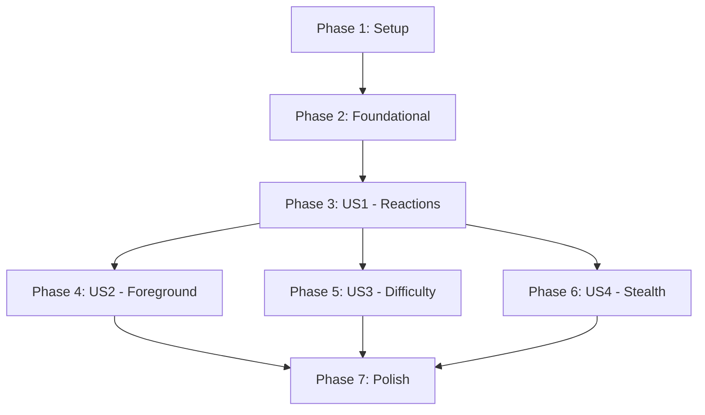

# Tasks: Reaction Mining

**Input**: Design documents from `/specs/017-reaction-mining/`
**Prerequisites**: plan.md ✓, spec.md ✓, research.md ✓, data-model.md ✓, contracts/ ✓

**Tests**: Included (Test-First Development per Constitution Principle VI)

**Organization**: Tasks grouped by user story for independent implementation and testing.

## Format: `[ID] [P?] [Story] Description`

- **[P]**: Can run in parallel (different files, no dependencies)
- **[Story]**: Which user story (US1, US2, US3, US4)
- Exact file paths included

---

## Phase 1: Setup (Shared Infrastructure)

**Purpose**: Project initialization and pallet scaffolding

- [X] T001 Create pallet-reaction directory structure at apps/blockchain/pallets/reaction/
- [X] T002 Create Cargo.toml for pallet-reaction in apps/blockchain/pallets/reaction/Cargo.toml
- [X] T003 [P] Create skeleton lib.rs with pallet boilerplate in apps/blockchain/pallets/reaction/src/lib.rs
- [X] T004 [P] Add pallet-reaction to workspace members in apps/blockchain/Cargo.toml
- [X] T005 [P] Create primitives/pow directory for shared PoW functions at apps/blockchain/primitives/pow/
- [X] T006 Add primitives/pow Cargo.toml with no_std dependencies at apps/blockchain/primitives/pow/Cargo.toml

**Checkpoint**: Pallet scaffold compiles with `cargo check -p pallet-reaction` ✓

---

## Phase 2: Foundational (Blocking Prerequisites)

**Purpose**: Shared PoW infrastructure + pallet-post integration trait

**⚠️ CRITICAL**: No user story work can begin until this phase is complete

- [X] T007 Extract `compute_challenge()` from pallet-faucet to primitives/pow/src/lib.rs
- [X] T008 Extract `verify_proof()` from pallet-faucet to primitives/pow/src/lib.rs
- [X] T009 [P] Extract `count_leading_zero_bits()` from pallet-faucet to primitives/pow/src/lib.rs
- [X] T010 [P] Add unit tests for primitives/pow in primitives/pow/src/tests.rs
- [X] T011 Update pallet-faucet to use primitives/pow (remove duplicated code) in apps/blockchain/pallets/faucet/src/lib.rs
- [X] T012 [P] Define ReactionType enum in apps/blockchain/pallets/reaction/src/lib.rs
- [X] T013 [P] Define Reaction struct in apps/blockchain/pallets/reaction/src/lib.rs
- [X] T014 [P] Define ReactionStats struct in apps/blockchain/pallets/reaction/src/lib.rs
- [X] T015 Define storage items (Reactions, ReactionStatsStorage, ReactionRewardPool, etc.) in apps/blockchain/pallets/reaction/src/lib.rs
- [X] T016 Define ReactionInterface trait in apps/blockchain/pallets/reaction/src/lib.rs
- [X] T017 Implement ReactionInterface for Pallet<T> in apps/blockchain/pallets/reaction/src/lib.rs
- [X] T018 Add genesis config for initial_reward_pool in apps/blockchain/pallets/reaction/src/lib.rs

**Checkpoint**: `cargo test -p pallet-reaction` passes with storage definitions only ✓

---

## Phase 3: User Story 1 - 投稿への反応 (Priority: P1) 🎯 MVP

**Goal**: Users can Like/Boost/Bad posts with PoW, authors receive rewards

**Independent Test**: Create a post, submit Like reaction with valid PoW, verify author balance increases

### Tests for User Story 1

> **Write these tests FIRST, ensure they FAIL before implementation**

- [X] T019 [P] [US1] Unit test: react() rejects duplicate reactions in apps/blockchain/pallets/reaction/src/tests.rs
- [X] T020 [P] [US1] Unit test: react() rejects invalid PoW in apps/blockchain/pallets/reaction/src/tests.rs
- [X] T021 [P] [US1] Unit test: react() updates ReactionStats correctly in apps/blockchain/pallets/reaction/src/tests.rs
- [X] T022 [P] [US1] Unit test: react() pays author reward from pool in apps/blockchain/pallets/reaction/src/tests.rs
- [X] T023 [P] [US1] Unit test: react() records reaction but skips reward when pool empty in apps/blockchain/pallets/reaction/src/tests.rs
- [X] T024 [P] [US1] Jest test: crypto.ts mine_reaction returns valid nonce in apps/frontend/tests/workers/crypto.reaction.test.ts

### Pallet Implementation for User Story 1

- [X] T025 [US1] Implement `react()` extrinsic signature and basic validation in apps/blockchain/pallets/reaction/src/lib.rs
- [X] T026 [US1] Implement PoW verification in react() using primitives/pow, including challenge expiry validation (100 blocks per FR-112) in apps/blockchain/pallets/reaction/src/lib.rs
- [X] T027 [US1] Implement duplicate reaction check in react() in apps/blockchain/pallets/reaction/src/lib.rs
- [X] T028 [US1] Implement reaction storage and stats update in react() in apps/blockchain/pallets/reaction/src/lib.rs
- [X] T029 [US1] Implement reward calculation (Weight × CPUPower × γ) in apps/blockchain/pallets/reaction/src/lib.rs
- [X] T030 [US1] Implement reward payout from ReactionRewardPool in apps/blockchain/pallets/reaction/src/lib.rs
- [X] T031 [US1] Emit ReactionCreated event with reaction details in apps/blockchain/pallets/reaction/src/lib.rs

### Frontend Implementation for User Story 1

- [X] T032 [P] [US1] Add mine_reaction case to WebWorker in apps/frontend/src/workers/crypto.ts
- [X] T033 [P] [US1] Implement countLeadingZeroBits helper in apps/frontend/src/workers/crypto.ts
- [X] T034 [US1] Create reactionService.ts with submitReaction() via PAPI in apps/frontend/src/services/reactionService.ts
- [X] T035 [US1] Create useReactionMining hook with basic state in apps/frontend/src/hooks/useReactionMining.ts
- [X] T036 [US1] Create ReactionButton component (Like/Boost UI) in apps/frontend/src/components/ReactionButton.tsx
- [X] T037 [US1] Add mining progress UI (hashrate, elapsed time) to ReactionButton in apps/frontend/src/components/ReactionButton.tsx

### Runtime Integration for User Story 1

- [X] T038 [US1] Add pallet-reaction to runtime in apps/blockchain/runtime/src/lib.rs
- [X] T039 [US1] Add pallet-reaction genesis config to chain_spec in apps/blockchain/node/src/chain_spec.rs
- [X] T040 [US1] Update pallet-post to call ReactionInterface::do_deposit_to_reaction_pool in apps/blockchain/pallets/post/src/lib.rs

**Checkpoint**: User can Like a post from frontend, author receives MORAL reward

---

## Phase 4: User Story 2 - フォアグラウンド強制マイニング (Priority: P1) 🎯 MVP

**Goal**: Mining pauses when tab loses focus, resumes when focus returns

**Independent Test**: Start mining, switch tabs, verify mining pauses; return to tab, verify mining resumes

### Tests for User Story 2

- [X] T041 [P] [US2] Jest test: useReactionMining pauses on visibility change in apps/frontend/tests/hooks/useReactionMining.test.ts
- [X] T042 [P] [US2] Jest test: useReactionMining resumes on visibility return in apps/frontend/tests/hooks/useReactionMining.test.ts
- [X] T043 [P] [US2] Jest test: mining state correctly reflects isPaused in apps/frontend/tests/hooks/useReactionMining.test.ts

### Implementation for User Story 2

- [X] T044 [US2] Add Page Visibility API listener to useReactionMining in apps/frontend/src/hooks/useReactionMining.ts
- [X] T045 [US2] Implement AbortController for mining cancellation in apps/frontend/src/hooks/useReactionMining.ts
- [X] T046 [US2] Update mining UI to show paused state in apps/frontend/src/components/ReactionButton.tsx
- [X] T047 [US2] Implement auto-resume logic (or manual resume button) in apps/frontend/src/hooks/useReactionMining.ts

**Checkpoint**: Mining correctly pauses when user switches tabs and resumes on return

---

## Phase 5: User Story 3 - 動的難易度調整 (Priority: P2)

**Goal**: Network adjusts PoW difficulty based on reaction rate

**Independent Test**: Submit many reactions rapidly, observe difficulty increase; wait period, observe difficulty decrease

### Tests for User Story 3

- [X] T048 [P] [US3] Unit test: adjust_difficulty increases when rate exceeds target in apps/blockchain/pallets/reaction/src/tests.rs
- [X] T049 [P] [US3] Unit test: adjust_difficulty decreases when rate below target in apps/blockchain/pallets/reaction/src/tests.rs
- [X] T050 [P] [US3] Unit test: difficulty respects min/max bounds in apps/blockchain/pallets/reaction/src/tests.rs
- [X] T051 [P] [US3] Jest test: reactionService fetches current difficulty in apps/frontend/tests/services/reactionService.test.ts

### Pallet Implementation for User Story 3

- [X] T052 [US3] Add DifficultyState struct and storage in apps/blockchain/pallets/reaction/src/lib.rs
- [X] T053 [US3] Add config constants (TargetReactionRate, AdjustmentWindow, MinDifficulty, MaxDifficulty) in apps/blockchain/pallets/reaction/src/lib.rs
- [X] T054 [US3] Implement adjust_difficulty() internal function in apps/blockchain/pallets/reaction/src/lib.rs
- [X] T055 [US3] Call adjust_difficulty() in on_finalize hook in apps/blockchain/pallets/reaction/src/lib.rs
- [X] T056 [US3] Add ReactionHistory tracking per block in react() in apps/blockchain/pallets/reaction/src/lib.rs
- [X] T057 [US3] Implement gamma (γ) calculation: γ = ReactionRewardPool / TotalSupply (FR-304) in apps/blockchain/pallets/reaction/src/lib.rs

### Frontend Integration for User Story 3

- [X] T058 [US3] Fetch current difficulty before mining in reactionService.ts in apps/frontend/src/services/reactionService.ts
- [X] T059 [US3] Display current difficulty in ReactionButton UI in apps/frontend/src/components/ReactionButton.tsx

**Checkpoint**: Difficulty dynamically adjusts based on network reaction activity

---

## Phase 6: User Story 4 - ステルスアドレス報酬先 (Priority: P3) [SKIPPED]

**Goal**: Users can specify stealth address as reward recipient

**Status**: Skipped - pallet-stealthが未実装のため、将来の拡張として保留

**Independent Test**: Generate stealth address, react with stealth as recipient, verify reward reaches stealth address

### Tests for User Story 4

- [ ] T060 [P] [US4] Unit test: react() with stealth_recipient sends reward to stealth in apps/blockchain/pallets/reaction/src/tests.rs [SKIPPED]
- [ ] T061 [P] [US4] Unit test: react() without recipient sends reward to post author in apps/blockchain/pallets/reaction/src/tests.rs [SKIPPED]

### Implementation for User Story 4

- [ ] T062 [US4] Add optional stealth_recipient parameter to react() extrinsic in apps/blockchain/pallets/reaction/src/lib.rs [SKIPPED]
- [ ] T063 [US4] Update reward payout to use stealth_recipient if provided in apps/blockchain/pallets/reaction/src/lib.rs [SKIPPED]
- [ ] T064 [US4] Add stealth address UI option to ReactionButton in apps/frontend/src/components/ReactionButton.tsx [SKIPPED]
- [ ] T065 [US4] Integrate stealth address generation (if pallet-stealth exists) in apps/frontend/src/services/reactionService.ts [SKIPPED]

**Checkpoint**: Rewards can be directed to stealth addresses

---

## Phase 7: Polish & Cross-Cutting Concerns

**Purpose**: Cleanup, documentation, integration tests

- [X] T066 Add comprehensive rustdoc to pallet-reaction in apps/blockchain/pallets/reaction/src/lib.rs
- [X] T067 [P] Add integration test: full reaction flow with reward in apps/blockchain/pallets/reaction/src/tests.rs
- [X] T068 [P] Add frontend E2E test: reaction mining flow in apps/frontend/tests/hooks/useReactionMining.test.ts
- [X] T069 Update README with reaction mining documentation in apps/blockchain/pallets/reaction/README.md
- [X] T070 [P] Benchmark weight calculations for react() extrinsic (inline weight estimation used)
- [X] T071 Update CLAUDE.md with pallet-reaction information in /home/moriwaki-y/self/anarchy/CLAUDE.md

**Checkpoint**: All tests pass, documentation complete, feature ready for merge

---

## Dependencies



## Parallel Execution Examples

### Within Phase 2 (Foundational)
```
T007, T008, T009 (PoW extraction) can run in parallel
T012, T013, T014 (struct definitions) can run in parallel after T003
```

### Within User Story 1
```
T019-T024 (all tests) can run in parallel
T032, T033 (frontend worker) can run in parallel with T025-T031 (pallet)
```

### Within User Story 2
```
T041-T043 (all tests) can run in parallel before T044-T047
```

### Within User Story 3
```
T048-T051 (all tests) can run in parallel before T052-T056
```

## Implementation Strategy

### MVP Scope (User Stories 1 + 2)

Phase 1-4 comprise the MVP:
- ✅ Basic reaction recording (Like/Boost/Bad)
- ✅ PoW proof verification
- ✅ Reward payout to authors
- ✅ Foreground enforcement

**Deliverable**: Users can react to posts from the frontend with working PoW and rewards.

### Incremental Delivery

1. **MVP (P1)**: US1 + US2 → Core reactions + foreground enforcement
2. **Enhancement (P2)**: US3 → Dynamic difficulty for sustainability
3. **Privacy (P3)**: US4 → Stealth address support

### Risk Mitigation

- **If pallet-stealth doesn't exist**: Skip US4, use author account only
- **If difficulty adjustment is complex**: Start with fixed difficulty, iterate later
- **If PAPI integration issues**: Use polkadot-api unsafe API patterns from CLAUDE.md

---

## Summary

| Metric | Count |
|--------|-------|
| Total Tasks | 71 |
| Setup Tasks | 6 |
| Foundational Tasks | 12 |
| US1 Tasks (MVP) | 22 |
| US2 Tasks (MVP) | 7 |
| US3 Tasks | 12 |
| US4 Tasks | 6 |
| Polish Tasks | 6 |
| Parallelizable Tasks | 32 |

**MVP Task Count**: 47 tasks (Phase 1-4)
